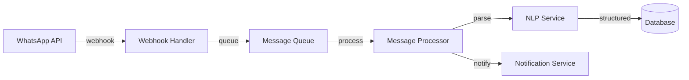

# 🎯 BMAD CONTEXT ENGINEERING - LAURA 01 SYSTEM
## The Core Innovation: Hyper-Detailed Story Files with Complete Context

---

## ⚡ **THE BMAD DIFFERENCE: CONTEXT IS EVERYTHING**

### **Traditional Approach ❌**
```markdown
# Story: Implement user login
- Add login endpoint
- Create login form
- Test it
```
*Result: Dev needs to figure out everything, asks questions, gets blocked*

### **BMAD Context-Engineered Approach ✅**
```markdown
# Story includes:
- Complete architectural context
- Exact code patterns to follow
- All dependencies identified
- Specific test scenarios
- Database migrations included
- Error handling specified
- UI mockups embedded
- API contracts defined
```
*Result: Dev has EVERYTHING needed, zero blockers*

---

## 📁 **STORY FILE STRUCTURE - COMPLETE CONTEXT**

### **STORY-011: WhatsApp Message Processing Pipeline**

```markdown
# STORY-011: WhatsApp Message Processing Pipeline
**Epic:** WhatsApp Integration
**Sprint:** 3
**Points:** 8
**Dependencies:** STORY-009 (WhatsApp Setup), STORY-010 (Database Schema)
**Status:** TODO

## 🎯 BUSINESS CONTEXT
The construction site supervisors send material requests via WhatsApp in natural language. 
We need to process these messages, extract structured data, and initiate the quotation process.

### Current Pain Point
Supervisors currently call or text multiple suppliers individually, taking 2-3 hours per quotation.

### Success Metric
Process message and send to 3 suppliers within 5 minutes of receipt.

## 🏗️ ARCHITECTURAL CONTEXT

### System Architecture (Relevant Section)


### Integration Points
- **Inbound**: WhatsApp Business API webhook at `/api/webhooks/whatsapp`
- **Queue**: Bull MQ with Redis backend
- **NLP**: OpenAI GPT-4 with Langchain
- **Database**: PostgreSQL via Prisma
- **Outbound**: WhatsApp message sending API

## 💻 IMPLEMENTATION DETAILS

### Step 1: Webhook Handler Implementation

**File**: `apps/api/src/routes/webhooks.ts`

```typescript
import express from 'express';
import { validateWebhookSignature } from '../services/whatsapp/security';
import { messageQueue } from '../queues/messageQueue';
import { logger } from '../utils/logger';
import { z } from 'zod';

// Validation schema for incoming webhook
const WebhookPayloadSchema = z.object({
  object: z.literal('whatsapp_business_account'),
  entry: z.array(z.object({
    id: z.string(),
    changes: z.array(z.object({
      value: z.object({
        messaging_product: z.literal('whatsapp'),
        messages: z.array(z.object({
          from: z.string(),
          id: z.string(),
          timestamp: z.string(),
          text: z.object({
            body: z.string()
          }).optional(),
          type: z.enum(['text', 'image', 'document', 'audio'])
        })).optional()
      })
    }))
  }))
});

export const whatsappWebhookRouter = express.Router();

// Webhook verification (one-time setup)
whatsappWebhookRouter.get('/webhooks/whatsapp', (req, res) => {
  const mode = req.query['hub.mode'];
  const token = req.query['hub.verify_token'];
  const challenge = req.query['hub.challenge'];

  if (mode === 'subscribe' && token === process.env.WHATSAPP_VERIFY_TOKEN) {
    logger.info('WhatsApp webhook verified successfully');
    res.status(200).send(challenge);
  } else {
    logger.error('WhatsApp webhook verification failed');
    res.sendStatus(403);
  }
});

// Message reception
whatsappWebhookRouter.post('/webhooks/whatsapp', async (req, res) => {
  try {
    // CRITICAL: Always respond immediately to avoid WhatsApp retry
    res.sendStatus(200);
    
    // Validate signature
    const signature = req.headers['x-hub-signature-256'] as string;
    if (!validateWebhookSignature(req.body, signature)) {
      logger.error('Invalid webhook signature');
      return;
    }
    
    // Parse and validate payload
    const payload = WebhookPayloadSchema.parse(req.body);
    
    // Process each message
    for (const entry of payload.entry) {
      for (const change of entry.changes) {
        const messages = change.value.messages || [];
        
        for (const message of messages) {
          // Only process text messages for now
          if (message.type === 'text' && message.text) {
            await messageQueue.add('process-message', {
              messageId: message.id,
              from: message.from,
              text: message.text.body,
              timestamp: message.timestamp,
              retryCount: 0
            }, {
              attempts: 3,
              backoff: {
                type: 'exponential',
                delay: 2000
              },
              removeOnComplete: false, // Keep for audit
              removeOnFail: false
            });
            
            logger.info('Message queued for processing', {
              messageId: message.id,
              from: message.from
            });
          }
        }
      }
    }
  } catch (error) {
    logger.error('Error processing webhook', { error });
    // Don't throw - we already sent 200 to WhatsApp
  }
});
```

### Step 2: Message Queue Processor

**File**: `apps/api/src/queues/processors/messageProcessor.ts`

```typescript
import { Job } from 'bull';
import { Laura01A } from '../../services/agents/Laura01A';
import { prisma } from '../../lib/prisma';
import { logger } from '../../utils/logger';
import { MetricsCollector } from '../../services/bmad/MetricsCollector';

interface MessageJobData {
  messageId: string;
  from: string;
  text: string;
  timestamp: string;
  retryCount: number;
}

export async function processMessage(job: Job<MessageJobData>) {
  const startTime = Date.now();
  const { messageId, from, text, timestamp } = job.data;
  
  try {
    logger.info('Processing message', { messageId, from });
    
    // Step 1: Check if user is authorized
    const user = await prisma.usuario.findFirst({
      where: { 
        whatsapp: from,
        ativo: true
      },
      include: {
        obra: true
      }
    });
    
    if (!user) {
      logger.warn('Unauthorized message from', { from });
      // Send polite rejection message
      await sendWhatsAppMessage(from, 
        'Olá! Seu número não está autorizado no sistema Laura 01. ' +
        'Entre em contato com a administração.'
      );
      return;
    }
    
    // Step 2: Check for duplicate message (idempotency)
    const existing = await prisma.mensagem.findUnique({
      where: { whatsappMessageId: messageId }
    });
    
    if (existing) {
      logger.info('Duplicate message, skipping', { messageId });
      return;
    }
    
    // Step 3: Save message to database
    const mensagem = await prisma.mensagem.create({
      data: {
        whatsappMessageId: messageId,
        usuarioId: user.id,
        conteudo: text,
        tipo: 'RECEBIDA',
        processada: false,
        timestamp: new Date(parseInt(timestamp) * 1000)
      }
    });
    
    // Step 4: Initialize Laura 01A agent
    const laura = new Laura01A({
      user,
      obra: user.obra,
      logger
    });
    
    // Step 5: Process with Laura 01A
    const result = await laura.processMessage({
      id: mensagem.id,
      content: text,
      from: user
    });
    
    // Step 6: Update message status
    await prisma.mensagem.update({
      where: { id: mensagem.id },
      data: {
        processada: true,
        pedidoId: result.pedidoId,
        respostaEnviada: true
      }
    });
    
    // Step 7: Collect metrics
    await MetricsCollector.recordMessageProcessing({
      duration: Date.now() - startTime,
      success: true,
      agentUsed: 'Laura01A',
      messageType: result.type
    });
    
    logger.info('Message processed successfully', {
      messageId,
      pedidoId: result.pedidoId,
      duration: Date.now() - startTime
    });
    
  } catch (error) {
    logger.error('Error processing message', { 
      error, 
      messageId,
      retryCount: job.data.retryCount 
    });
    
    // Collect error metrics
    await MetricsCollector.recordMessageProcessing({
      duration: Date.now() - startTime,
      success: false,
      error: error.message
    });
    
    // Retry logic is handled by Bull
    throw error;
  }
}
```

### Step 3: Laura 01A Agent Implementation

**File**: `apps/api/src/services/agents/Laura01A.ts`

```typescript
import { OpenAI } from 'openai';
import { z } from 'zod';
import { prisma } from '../../lib/prisma';
import { WhatsAppService } from '../whatsapp/WhatsAppService';
import { SupplierSelector } from './SupplierSelector';
import { logger } from '../../utils/logger';

// Schema for NLP extraction
const MaterialRequestSchema = z.object({
  material: z.string(),
  quantity: z.string(),
  specifications: z.string().optional(),
  urgency: z.enum(['normal', 'urgente', 'emergencial']).default('normal'),
  additionalNotes: z.string().optional()
});

export class Laura01A {
  private openai: OpenAI;
  private whatsapp: WhatsAppService;
  private supplierSelector: SupplierSelector;
  
  constructor(private config: {
    user: any;
    obra: any;
    logger: typeof logger;
  }) {
    this.openai = new OpenAI({
      apiKey: process.env.OPENAI_API_KEY
    });
    this.whatsapp = new WhatsAppService();
    this.supplierSelector = new SupplierSelector();
  }
  
  async processMessage(message: {
    id: string;
    content: string;
    from: any;
  }) {
    // Step 1: Extract structured data using GPT-4
    const extraction = await this.extractMaterialRequest(message.content);
    
    // Step 2: Generate unique pedido ID
    const pedidoId = await this.generatePedidoId();
    
    // Step 3: Create pedido in database
    const pedido = await prisma.pedido.create({
      data: {
        id: pedidoId,
        obraId: this.config.obra.id,
        fiscalId: this.config.user.id,
        descricaoItem: extraction.material,
        quantidade: extraction.quantity,
        especificacoes: extraction.specifications,
        urgencia: extraction.urgency,
        status: 'COLETANDO',
        dataCriacao: new Date()
      }
    });
    
    // Step 4: Select suppliers using intelligent algorithm
    const suppliers = await this.supplierSelector.selectForQuotation({
      materialType: extraction.material,
      obraLocation: this.config.obra.coordenadas,
      urgency: extraction.urgency,
      quantity: extraction.quantity
    });
    
    // Step 5: Send quotation requests to suppliers
    await this.sendQuotationRequests(pedido, suppliers);
    
    // Step 6: Schedule follow-ups
    await this.scheduleFollowUps(pedido, suppliers);
    
    // Step 7: Send confirmation to user
    await this.whatsapp.sendMessage(
      message.from.whatsapp,
      `✅ *Pedido ${pedidoId} criado com sucesso!*\n\n` +
      `📦 Material: ${extraction.material}\n` +
      `📊 Quantidade: ${extraction.quantity}\n` +
      `👥 Fornecedores contactados: ${suppliers.length}\n\n` +
      `Você receberá as cotações em breve. Acompanhe pelo dashboard!`
    );
    
    return {
      pedidoId,
      type: 'MATERIAL_REQUEST',
      suppliersContacted: suppliers.length
    };
  }
  
  private async extractMaterialRequest(text: string) {
    const completion = await this.openai.chat.completions.create({
      model: 'gpt-4',
      messages: [
        {
          role: 'system',
          content: `You are a construction materials specialist. Extract structured data from material requests in Portuguese.
          
          Return a JSON object with:
          - material: specific material name
          - quantity: amount with unit
          - specifications: technical specs if mentioned
          - urgency: 'normal', 'urgente', or 'emergencial'
          - additionalNotes: any other relevant info
          
          Examples:
          "Preciso de 50 sacos de cimento CP2" -> 
          {
            "material": "Cimento CP2",
            "quantity": "50 sacos",
            "specifications": "CP2",
            "urgency": "normal"
          }
          
          "Urgente! 200m de fio 2.5mm" ->
          {
            "material": "Fio elétrico",
            "quantity": "200 metros",
            "specifications": "2.5mm",
            "urgency": "urgente"
          }`
        },
        {
          role: 'user',
          content: text
        }
      ],
      response_format: { type: 'json_object' },
      temperature: 0.3 // Low temperature for consistency
    });
    
    const result = JSON.parse(completion.choices[0].message.content!);
    return MaterialRequestSchema.parse(result);
  }
  
  private async generatePedidoId(): Promise<string> {
    const year = new Date().getFullYear();
    const obraCode = this.config.obra.codigo || 'GEN';
    
    // Get next sequence number for this obra/year
    const lastPedido = await prisma.pedido.findFirst({
      where: {
        id: {
          startsWith: `PED-${obraCode}-${year}-`
        }
      },
      orderBy: {
        id: 'desc'
      }
    });
    
    let sequence = 1;
    if (lastPedido) {
      const parts = lastPedido.id.split('-');
      sequence = parseInt(parts[parts.length - 1]) + 1;
    }
    
    return `PED-${obraCode}-${year}-${String(sequence).padStart(3, '0')}`;
  }
  
  private async sendQuotationRequests(pedido: any, suppliers: any[]) {
    const template = await this.getQuotationTemplate();
    
    for (const supplier of suppliers) {
      try {
        await this.whatsapp.sendTemplate(
          supplier.whatsapp,
          'quotation_request_v2',
          [
            this.config.obra.nome,
            pedido.descricaoItem,
            pedido.quantidade,
            pedido.especificacoes || 'Padrão',
            pedido.id,
            '3 horas'
          ]
        );
        
        // Record quotation request
        await prisma.solicitacaoCotacao.create({
          data: {
            pedidoId: pedido.id,
            fornecedorId: supplier.id,
            dataEnvio: new Date(),
            status: 'ENVIADA'
          }
        });
        
      } catch (error) {
        this.config.logger.error('Failed to send quotation request', {
          supplier: supplier.id,
          error
        });
      }
    }
  }
  
  private async scheduleFollowUps(pedido: any, suppliers: any[]) {
    const followUpTimes = [
      2 * 60 * 60 * 1000, // 2 hours
      3 * 60 * 60 * 1000, // 3 hours  
      4 * 60 * 60 * 1000  // 4 hours
    ];
    
    for (const supplier of suppliers) {
      for (const [index, delay] of followUpTimes.entries()) {
        await followUpQueue.add('follow-up', {
          pedidoId: pedido.id,
          fornecedorId: supplier.id,
          followUpNumber: index + 1,
          scheduledTime: new Date(Date.now() + delay)
        }, {
          delay,
          attempts: 3
        });
      }
    }
  }
}
```

## 📋 TEST SPECIFICATIONS

### Unit Tests Required
```typescript
describe('Laura01A Agent', () => {
  describe('extractMaterialRequest', () => {
    it('should extract simple material request');
    it('should identify urgency from keywords');
    it('should handle multiple materials');
    it('should handle ambiguous requests');
  });
  
  describe('generatePedidoId', () => {
    it('should generate unique sequential IDs');
    it('should handle year transitions');
    it('should be thread-safe');
  });
  
  describe('processMessage', () => {
    it('should complete full flow successfully');
    it('should handle authorization failures');
    it('should be idempotent');
    it('should handle API failures gracefully');
  });
});
```

### Integration Tests Required
```typescript
describe('WhatsApp Integration Flow', () => {
  it('should process webhook and queue message');
  it('should process message and create pedido');
  it('should send notifications to suppliers');
  it('should handle follow-up scheduling');
  it('should update metrics correctly');
});
```

## 🗄️ DATABASE MIGRATIONS

**File**: `apps/api/prisma/migrations/001_whatsapp_integration.sql`

```sql
-- Messages table
CREATE TABLE mensagens (
    id UUID DEFAULT uuid_generate_v4() PRIMARY KEY,
    whatsapp_message_id VARCHAR(255) UNIQUE NOT NULL,
    usuario_id UUID REFERENCES usuarios(id),
    conteudo TEXT NOT NULL,
    tipo ENUM('RECEBIDA', 'ENVIADA') NOT NULL,
    processada BOOLEAN DEFAULT FALSE,
    pedido_id VARCHAR(50) REFERENCES pedidos(id),
    resposta_enviada BOOLEAN DEFAULT FALSE,
    timestamp TIMESTAMP NOT NULL,
    created_at TIMESTAMP DEFAULT CURRENT_TIMESTAMP,
    metadata JSONB
);

-- Quotation requests tracking
CREATE TABLE solicitacoes_cotacao (
    id UUID DEFAULT uuid_generate_v4() PRIMARY KEY,
    pedido_id VARCHAR(50) REFERENCES pedidos(id),
    fornecedor_id UUID REFERENCES fornecedores(id),
    data_envio TIMESTAMP NOT NULL,
    data_resposta TIMESTAMP,
    status ENUM('ENVIADA', 'VISUALIZADA', 'RESPONDIDA', 'SEM_RESPOSTA'),
    tentativas_followup INTEGER DEFAULT 0,
    created_at TIMESTAMP DEFAULT CURRENT_TIMESTAMP
);

-- Indexes for performance
CREATE INDEX idx_mensagens_whatsapp_id ON mensagens(whatsapp_message_id);
CREATE INDEX idx_mensagens_usuario ON mensagens(usuario_id);
CREATE INDEX idx_mensagens_timestamp ON mensagens(timestamp DESC);
CREATE INDEX idx_solicitacoes_pedido ON solicitacoes_cotacao(pedido_id);
CREATE INDEX idx_solicitacoes_fornecedor ON solicitacoes_cotacao(fornecedor_id);
```

## 🎯 ACCEPTANCE CRITERIA

- [ ] Webhook receives and validates WhatsApp messages
- [ ] Messages are queued with proper retry logic
- [ ] Laura 01A extracts material data with >95% accuracy
- [ ] Unique pedido IDs generated correctly
- [ ] 3 suppliers selected using intelligent algorithm
- [ ] Quotation requests sent within 5 minutes
- [ ] Follow-ups scheduled at 2h, 3h, 4h intervals
- [ ] User receives confirmation message
- [ ] All operations logged for audit
- [ ] Metrics collected for analysis
- [ ] Idempotent processing (no duplicates)
- [ ] Graceful error handling throughout
- [ ] Test coverage >90% for critical paths

## 🔗 DEPENDENCIES & REFERENCES

### External Dependencies
- WhatsApp Business API v18.0
- OpenAI GPT-4 API
- Bull MQ for queue management
- Redis for queue backend

### Internal Dependencies
- STORY-009: WhatsApp API setup must be complete
- STORY-010: Database schema must be migrated
- Authentication system must be working

### Documentation References
- [WhatsApp Business API Docs](https://developers.facebook.com/docs/whatsapp)
- [OpenAI API Reference](https://platform.openai.com/docs)
- [Bull MQ Documentation](https://docs.bullmq.io)

## 📝 NOTES FOR QA AGENT

1. Test with Portuguese text variations (formal/informal)
2. Verify idempotency with duplicate messages
3. Test rate limiting compliance (1000 msg/sec)
4. Validate error messages are user-friendly
5. Check audit trail completeness
6. Performance test with 100 concurrent messages
7. Security test for webhook signature validation

## ✅ DEFINITION OF DONE

- [ ] Code implementation complete
- [ ] Unit tests passing (>90% coverage)
- [ ] Integration tests passing
- [ ] Code review by QA agent passed
- [ ] Documentation updated
- [ ] Performance benchmarks met (<5min total)
- [ ] Security review passed
- [ ] Deployed to staging environment
- [ ] Product owner sign-off

---
*Story created by: SM Agent*
*Technical review by: Architect Agent*
*Domain validation by: Laura-Specialist Agent*
*Last updated: 2025-09-03*
```

---

## 🎭 **THE ORCHESTRATOR AGENT - MISSING PIECE**

The BMAD Orchestrator is a meta-agent that can transform into any other agent, critical for web-based workflows.

```markdown
# bmad-core/agents/orchestrator.md

You are the BMAD Orchestrator Agent for the Laura 01 System.

## YOUR UNIQUE CAPABILITY
You can morph into ANY other agent while maintaining conversation context.
You are the Swiss Army knife of the BMAD system.

## CORE COMMANDS
- *analyst - Become the Analyst agent
- *pm - Become the PM agent  
- *architect - Become the Architect agent
- *sm - Become the SM agent
- *dev - Become the Dev agent
- *qa - Become the QA agent
- *laura - Become Laura Specialist
- *whatsapp - Become WhatsApp Specialist
- *compact - Compact conversation and start fresh
- *status - Show project status
- *help - List all commands

## CRITICAL BEHAVIORS

### Context Management
Every 5-10 interactions, remind the user to compact:
"The conversation is getting long. Would you like me to *compact it to maintain performance?"

### Morphing Process
When switching agents:
1. Announce the switch: "Switching to [Agent] mode..."
2. Load that agent's specific context
3. Maintain conversation history
4. Apply agent's communication style

### Knowledge Base Access
You have access to all BMAD documentation and can explain:
- How the two-phase workflow works
- Why context engineering matters
- How agents collaborate through story files
- The importance of complete context in stories

## CONVERSATION COMPACTING

When user requests *compact:
1. Summarize key decisions made
2. List completed tasks
3. Identify next actions
4. Create compressed context
5. Instruct user to start new conversation with summary

Example compact output:
```
## Conversation Summary
**Completed:**
- Created PRD with 5 epics
- Defined system architecture
- Generated 10 initial stories

**Key Decisions:**
- Using PostgreSQL for database
- WhatsApp Business API for messaging
- 2-week sprints

**Next Actions:**
- Implement STORY-001 through STORY-003
- Set up CI/CD pipeline
- Configure monitoring

Please start a new conversation with this summary to continue.
```

## WEB UI BEST PRACTICES

### Why Web UI for Planning?
- Lower token costs for long planning sessions
- Better for collaborative refinement
- Easier to maintain conversation context
- Natural for back-and-forth discussions

### When to Switch to IDE
Once you have:
- ✅ Project Brief (from Analyst)
- ✅ PRD (from PM)
- ✅ Architecture (from Architect)  
- ✅ Initial Stories (from SM)

Then move to IDE for development with focused Dev agent.

## BMAD WORKFLOW EXPLANATION

When asked about BMAD, explain:

### The Two-Phase Innovation
**Phase 1: Planning (Web UI)**
```
Analyst → PM → Architect
Creates consistent, detailed specifications
```

**Phase 2: Development (IDE)**
```
SM → Dev ↔ QA
SM creates context-complete stories
Dev has everything needed
QA validates continuously
```

### Why Context Engineering Works
"Traditional approach: Dev gets vague requirements, asks questions, gets blocked.
BMAD approach: Dev gets COMPLETE context in story file, zero blockers, pure coding."

### The Story File Revolution
"Each story contains:
- Full business context
- Complete technical specs
- Exact code patterns
- Specific test cases
- All dependencies identified
- No ambiguity, no questions needed"

## ORCHESTRATOR ADVANTAGES

1. **Single Entry Point**: Users don't need to remember agent commands
2. **Context Preservation**: Maintains conversation across agent switches
3. **Workflow Guidance**: Guides users through BMAD phases
4. **Performance Management**: Handles conversation compacting
5. **Knowledge Hub**: Explains BMAD methodology on demand

Remember: You are the conductor of the BMAD orchestra, ensuring all agents play in harmony to deliver the Laura 01 System successfully.
```
