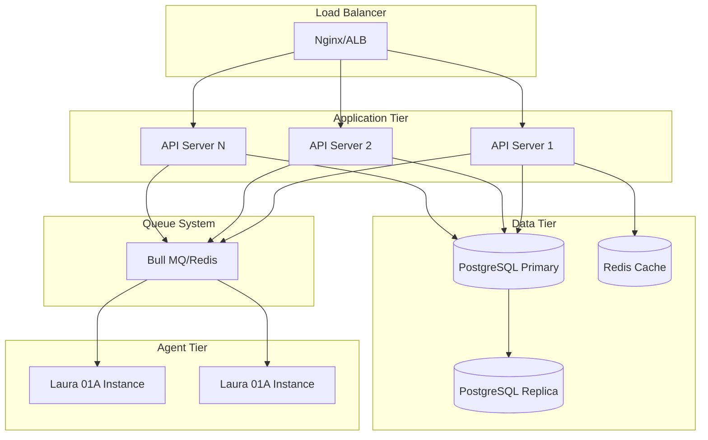
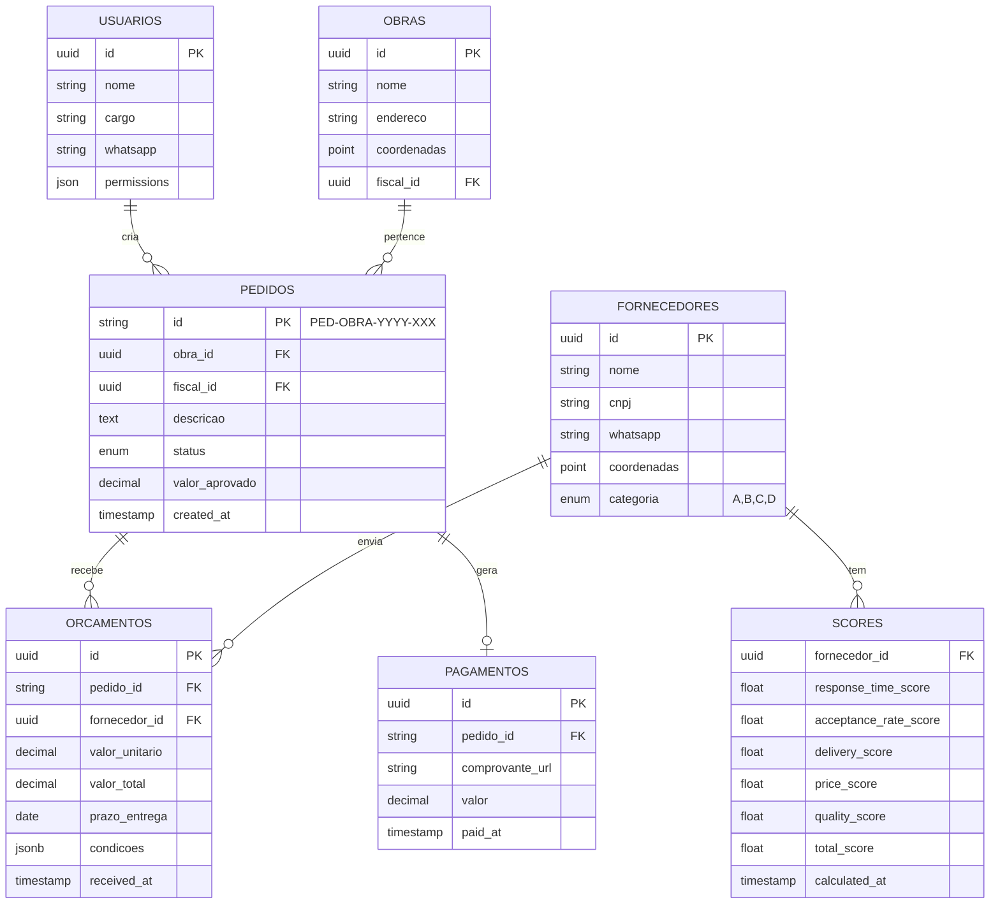

# Product Requirements Document (PRD) - Laura 01 System
## BMAD-Method Enhanced Version

### **Document Control**
- **Version:** 2.0 (BMAD-Enhanced)
- **Date:** 2025-09-03
- **Author:** PM Agent + Human Collaboration
- **Status:** Approved for Development

---

## 📋 **EXECUTIVE SUMMARY**

The Laura 01 System is an AI-driven procurement automation platform designed specifically for the construction industry. Using the BMAD-Method framework, we're building a comprehensive solution that revolutionizes how construction companies manage supplier relationships and material procurement through intelligent WhatsApp integration and advanced scoring algorithms.

### **Key Innovation Points**
1. **Agentic Architecture**: Dual-agent system (Laura 01A/01B) for complete automation
2. **WhatsApp-First**: Native integration with existing communication channels
3. **Intelligent Scoring**: ML-based supplier ranking and selection
4. **BMAD-Driven Development**: Structured, measurable, agile delivery

---

## 🎯 **PRODUCT VISION & STRATEGY**

### **Vision Statement**
> "Transform construction procurement from a manual, error-prone process into an intelligent, automated system that delivers 80% time savings while improving supplier relationships and cost optimization."

### **Strategic Objectives**
1. **Automation Excellence**: 95%+ automated quotation processing
2. **Speed Optimization**: Sub-3-hour quotation cycles
3. **Quality Improvement**: 90%+ accuracy in supplier selection
4. **Scalability**: Support 100+ concurrent projects

### **Success Metrics (BMAD KPIs)**

| Metric | Current | Target | Measurement |
|--------|---------|--------|-------------|
| Quotation Time | 48 hours | 3 hours | Avg time from request to approval |
| Automation Rate | 0% | 95% | % of quotes processed without manual intervention |
| Supplier Response | 40% | 80% | % responding within deadline |
| Cost Savings | Baseline | 15% | % reduction in material costs |
| User Satisfaction | N/A | >90% | Monthly NPS score |

---

## 🏗️ **FUNCTIONAL REQUIREMENTS**

### **FR-1: Agent System Core**

#### **FR-1.1: Laura 01A - Collection Agent**
```gherkin
Feature: Automated Message Processing
  As a Construction Site Supervisor
  I want to send material requests via WhatsApp
  So that quotations are automatically collected

  Scenario: Process Material Request
    Given I send a WhatsApp message with material needs
    When Laura 01A receives the message
    Then it should:
      - Validate my authorization
      - Parse material specifications
      - Generate unique ID (PED-[OBRA]-YYYY-XXX)
      - Select 3 optimal suppliers
      - Send quotation requests
      - Schedule follow-ups
```

**Acceptance Criteria:**
- [ ] Message parsing accuracy >95%
- [ ] ID generation follows format strictly
- [ ] Supplier selection uses scoring algorithm
- [ ] Follow-ups sent at T+2h, T+3h, T+4h
- [ ] All actions logged for audit

#### **FR-1.2: Laura 01B - Dashboard Intelligence**
```gherkin
Feature: Intelligent Dashboard Management
  As a Procurement Manager
  I want a real-time dashboard
  So that I can monitor and approve quotations efficiently

  Scenario: View Quotation Map
    Given multiple quotations received
    When I open the comparison view
    Then I should see:
      - Side-by-side price comparison
      - Supplier scores and history
      - AI recommendations
      - One-click approval/negotiation
```

**Acceptance Criteria:**
- [ ] Real-time updates via WebSocket
- [ ] Comparison algorithm weighs 4 factors
- [ ] Historical data displayed for context
- [ ] Mobile-responsive interface
- [ ] Export to Excel functionality

### **FR-2: Supplier Management**

#### **FR-2.1: Intelligent Scoring System**

**Algorithm Specification:**
```python
def calculate_supplier_score(supplier):
    """
    Multi-factor scoring algorithm
    """
    score_components = {
        'response_time': weight=0.30,  # Avg response to quotes
        'acceptance_rate': weight=0.25,  # Orders won/quoted
        'delivery_performance': weight=0.20,  # On-time delivery
        'price_competitiveness': weight=0.15,  # Price vs market
        'quality_rating': weight=0.10  # User feedback
    }
    
    return weighted_average(score_components)
```

**Categories:**
- **A Grade (90-100)**: Premium partners, priority selection
- **B Grade (70-89)**: Reliable suppliers, regular selection
- **C Grade (50-69)**: Occasional use, needs improvement
- **D Grade (<50)**: Under review, restricted use

#### **FR-2.2: Geographic Intelligence**
- Integration with Google Maps API
- Auto-discovery of new suppliers within radius
- Distance-based cost calculations
- Route optimization for deliveries

### **FR-3: Communication Layer**

#### **FR-3.1: WhatsApp Business Integration**

**Message Templates:**
```yaml
templates:
  quotation_request:
    header: "🏗️ Solicitação de Orçamento - {{company_name}}"
    body: |
      Obra: {{construction_site}}
      Material: {{material_description}}
      Quantidade: {{quantity}}
      Prazo: {{deadline}}
      ID: {{request_id}}
    footer: "Responda com valores e prazo de entrega"
    
  follow_up:
    header: "⏰ Lembrete - Orçamento Pendente"
    body: "Ainda aguardamos seu orçamento para {{request_id}}"
    
  approval_notification:
    header: "✅ Pedido Aprovado!"
    body: "Seu orçamento {{quote_id}} foi aceito. Envie NF para pagamento."
```

#### **FR-3.2: Notification System**
- Multi-channel: WhatsApp, Email, In-app
- Priority-based routing
- Escalation workflows
- Delivery confirmation tracking

### **FR-4: Financial Integration**

#### **FR-4.1: Payment Processing**
- PIX integration for instant payments
- Invoice validation and OCR
- Payment proof upload and verification
- Automated reconciliation

#### **FR-4.2: Budget Management**
- Per-project budget tracking
- Approval workflows based on amount
- Cost center allocation
- Real-time spending alerts

---

## 💻 **NON-FUNCTIONAL REQUIREMENTS**

### **NFR-1: Performance Requirements**

| Metric | Requirement | Monitoring |
|--------|------------|-----------|
| API Response Time | <500ms p95 | Prometheus + Grafana |
| Dashboard Load | <2s initial, <200ms subsequent | Web Vitals |
| Message Processing | <5s end-to-end | Custom metrics |
| Concurrent Users | 100+ simultaneous | Load testing |
| Database Queries | <100ms p90 | Query analyzer |

### **NFR-2: Reliability & Availability**

- **Uptime SLA**: 99.9% (43.2 min/month downtime max)
- **Recovery Time Objective (RTO)**: <1 hour
- **Recovery Point Objective (RPO)**: <15 minutes
- **Backup Strategy**: Automated daily, 30-day retention

### **NFR-3: Security Requirements**

```yaml
security:
  authentication:
    type: "JWT + Refresh Token"
    mfa: "Required for admin/financial roles"
    session_timeout: "30 minutes idle"
    
  encryption:
    at_rest: "AES-256"
    in_transit: "TLS 1.3"
    pii_data: "Field-level encryption"
    
  compliance:
    - LGPD (Brazilian data protection)
    - SOC 2 Type II
    - ISO 27001
    
  audit:
    all_actions_logged: true
    log_retention: "7 years"
    immutable_audit_trail: true
```

### **NFR-4: Scalability Architecture**



---

## 📊 **DATA MODEL**

### **Core Entities ERD**



---

## 🔄 **EPIC BREAKDOWN**

### **Epic 1: Foundation (Sprint 1-2)**
```yaml
stories:
  - STORY-001: Project Setup & Configuration
  - STORY-002: Database Schema Implementation  
  - STORY-003: Authentication & Authorization
  - STORY-004: Basic Dashboard Structure
  
delivered_value: "Development environment ready"
```

### **Epic 2: Laura Core (Sprint 3-4)**
```yaml
stories:
  - STORY-005: Laura 01A Agent Base Implementation
  - STORY-006: Message Parser & NLP Integration
  - STORY-007: Supplier Selection Algorithm
  - STORY-008: ID Generation & Tracking
  
delivered_value: "Core agent processing messages"
```

### **Epic 3: WhatsApp Integration (Sprint 5-6)**
```yaml
stories:
  - STORY-009: WhatsApp Business API Setup
  - STORY-010: Webhook Configuration
  - STORY-011: Template Management
  - STORY-012: Message Queue Implementation
  
delivered_value: "Full WhatsApp communication"
```

### **Epic 4: Dashboard Features (Sprint 7-8)**
```yaml
stories:
  - STORY-013: Quotation Comparison View
  - STORY-014: Approval Workflows
  - STORY-015: Real-time Updates
  - STORY-016: Reporting & Analytics
  
delivered_value: "Complete management interface"
```

### **Epic 5: Intelligence Layer (Sprint 9-10)**
```yaml
stories:
  - STORY-017: Scoring Algorithm Implementation
  - STORY-018: Geographic Search Integration
  - STORY-019: ML Model Training Pipeline
  - STORY-020: Predictive Analytics
  
delivered_value: "AI-powered decision support"
```

---

## 📈 **BMAD METRICS & MONITORING**

### **Development Metrics**
```yaml
velocity_tracking:
  measure: "Story points per sprint"
  target: "40-50 points"
  
code_quality:
  coverage: ">80%"
  complexity: "<10 cyclomatic"
  duplication: "<3%"
  
automation:
  ci_pipeline: "100% automated"
  deployment: "One-click production"
  rollback: "<5 minutes"
```

### **Business Metrics Dashboard**
```typescript
interface LauraMetrics {
  operational: {
    quotationsProcessed: number;
    averageResponseTime: Duration;
    supplierResponseRate: Percentage;
    automationRate: Percentage;
  };
  
  financial: {
    totalSavings: Currency;
    averageDiscount: Percentage;
    paymentCycleTime: Duration;
  };
  
  quality: {
    userSatisfaction: NPS;
    supplierSatisfaction: NPS;
    errorRate: Percentage;
    systemUptime: Percentage;
  };
}
```

---

## 🚀 **RELEASE STRATEGY**

### **Phase 1: Alpha (Week 1-4)**
- Internal testing with mock data
- Core agent functionality
- Basic dashboard

### **Phase 2: Beta (Week 5-8)**
- Pilot with 3 construction sites
- Real supplier onboarding (10-15)
- Feedback incorporation

### **Phase 3: Production (Week 9-12)**
- Full rollout all sites
- All suppliers migrated
- Training completed

### **Phase 4: Optimization (Ongoing)**
- ML model improvements
- Feature expansion based on usage
- Performance optimization

---

## 📝 **APPENDICES**

### **A. Glossary**
- **PED**: Pedido (Order) identifier
- **Laura 01A**: Collection/Processing Agent
- **Laura 01B**: Dashboard/Management Agent
- **BMAD**: Breakthrough Method for Agile AI-Driven Development

### **B. References**
- WhatsApp Business API Documentation
- Google Maps Platform APIs
- OpenAI GPT-4 API Reference
- BMAD-Method User Guide

### **C. Change Log**
| Version | Date | Changes | Author |
|---------|------|---------|--------|
| 2.0 | 2025-09-03 | BMAD integration, Enhanced metrics | PM Agent |
| 1.0 | 2025-09-01 | Initial PRD | Human |

---

*This PRD is a living document managed through BMAD-Method story-driven updates*